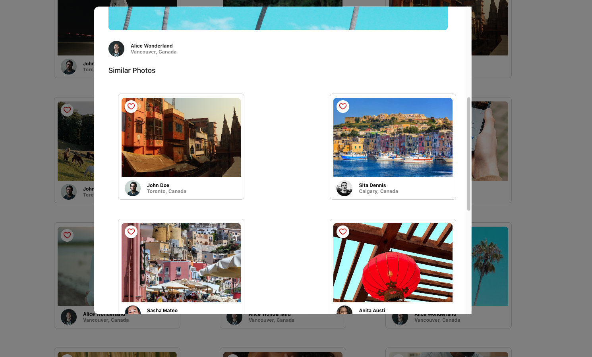

# Photolabs

A place to showcase photos and their authors!

## Setup

Install dependencies with `npm install` in each respective `/frontend` and `/backend`.

## [Backend] Running Backend Servier

Read `backend/readme` for further setup details.

```sh
cd backend
npm start
```

## [Frontend] Running Webpack Development Server

```sh
cd frontend
npm start
```

Navigate to [port:3000](http://localhost:3000) and you should be good to go!

# Usage

You can view similar photos of one topic by clicking your desired topic above!



